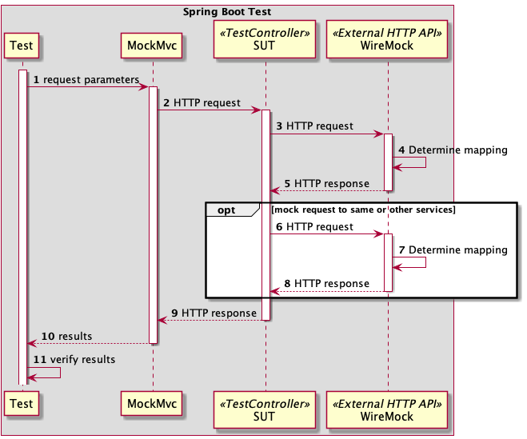

# Simple WireMock Spring Boot Demo

## Why?

In tests to simulate response from external service when real HTTP traffic is required e.g. mutual TLS.

## How?

Big picture



where:
- SUT - System Under Test (e.g. endpoint, service)

## What

WireMock is a part of Spring Cloud Contract.

## Scenarios

1. [JSON stubbing with stateful behaviour - good to test positive path](src/test/java/com/gitlab/marcinnowakcodes/WiremockDemoApplicationTests.java)
2. [Java stubbing - good to test negative path](src/test/java/com/gitlab/marcinnowakcodes/WiremockDemoApplicationTests.java)
3. [HTML stubbing - to implement web scraper for service without API](src/test/java/com/gitlab/marcinnowakcodes/WiremockDemoApplicationTests.java)
4. Standalone mode - acceptance/performance/system test on environment when access to external sandbox is not possible

### Standalone mode

Run Wiremock:

```shell
java -jar /path-to-your-wiremock/wiremock-jre8-standalone-2.33.0.jar --port=8090 --local-response-templating --root-dir ./src/test/resources/contracts
```

Check Wiremock response:

```shell
curl -H "Accept: application/json, application/*+json" http://localhost:8090/welcome?name=Team
```

Run Spring Boot application:

```shell
./mvnw spring-boot:run
```

Check `TestController` response with:

```shell
curl http://localhost:8080/json
```

## Reference Documentation

For further reference, please consider the following sections:

* [WireMock](https://wiremock.org/)
* [Spring Cloud Contract WireMock](https://docs.spring.io/spring-cloud-contract/docs/current/reference/html/project-features.html#features-wiremock)

## Guides

The following guides illustrate how to use some features concretely:

* [Introduction to WireMock 2](https://app.pluralsight.com/library/courses/wiremock-introduction/table-of-contents)


## Alternative tools

* [PACT](https://pact.io/). 
  [How does Pact differ from Spring Cloud Contract?](https://docs.pact.io/getting_started/comparisons#how-does-pact-differ-from-spring-cloud-contract) 

## Build project

To build project you need to install `plantuml` with your favorite package manager. 
On Mac:

```shell
brew install plantuml
```

Or comment/delete whole `<plugin>....</plugin>` for `plantuml` section in `pom.xml`.